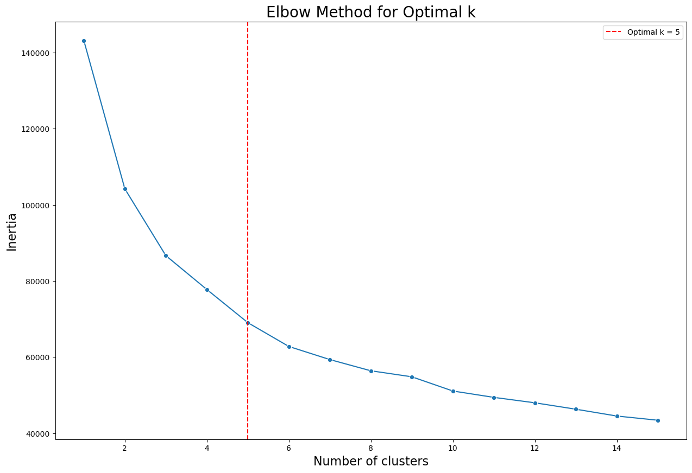
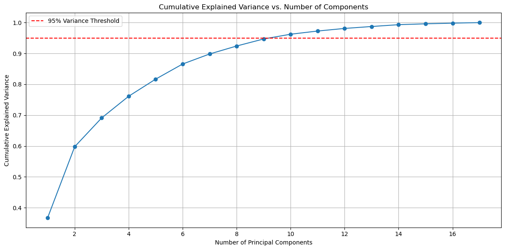
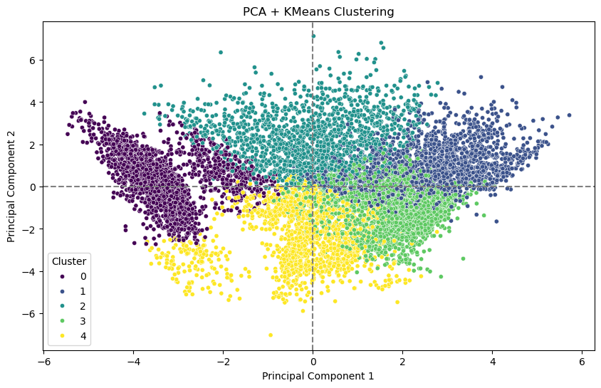
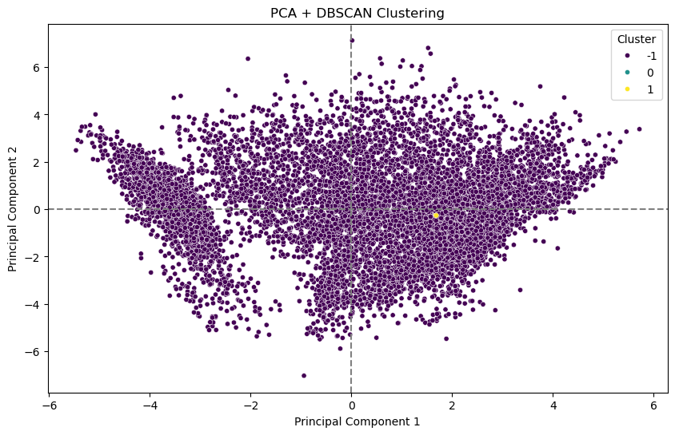
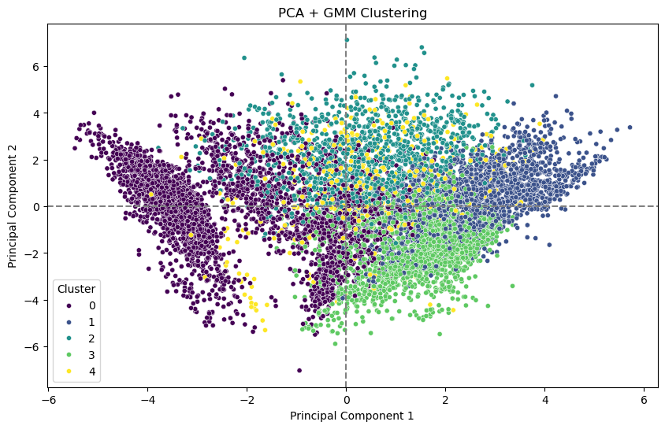

# 💡 미션 목표

신용 카드 회사의 마케팅 담당자라고 상상하고, 고객의 사용 패턴을 분석하여 고객을 몇 개의 그룹으로 세분화하고, 각 그룹에 맞는 마케팅 전략을 수립할 것인지, 이를 통해 회사의 매출을 증대시키고, 고객 만족도를 높이는 방법을 찾는 것이 목표!

# 데이터 설명

Kaggle 내 데이터 설명에는 다음과 같은 글이 적혀 있었다.

## Kaggle 내 데이터 설명 원문

## **About Dataset**

This case requires to develop a customer segmentation to define marketing strategy. The sample Dataset summarizes the usage behavior of about 9000 active credit card holders during the last 6 months. The file is at a customer level with 18 behavioral variables.

Following is the Data Dictionary for Credit Card dataset :-

- `CUST_ID` : Identification of Credit Card holder (Categorical)
- `BALANCE` : Balance amount left in their account to make purchases (
- `BALANCE_FREQUENCY` : How frequently the Balance is updated, score between 0 and 1 (1 = frequently updated, 0 = not frequently updated)
- `PURCHASES` : Amount of purchases made from account
- `ONEOFF_PURCHASES` : Maximum purchase amount done in one-go
- `INSTALLMENTS_PURCHASES` : Amount of purchase done in installment
- `CASH_ADVANCE` : Cash in advance given by the user
- `PURCHASES_FREQUENCY` : How frequently the Purchases are being made, score between 0 and 1 (1 = frequently purchased, 0 = not frequently purchased)
- `ONEOFFPURCHASESFREQUENCY` : How frequently Purchases are happening in one-go (1 = frequently purchased, 0 = not frequently purchased)
- `PURCHASESINSTALLMENTSFREQUENCY` : How frequently purchases in installments are being done (1 = frequently done, 0 = not frequently done)
- `CASHADVANCEFREQUENCY` : How frequently the cash in advance being paid
- `CASHADVANCETRX` : Number of Transactions made with "Cash in Advanced"
- `PURCHASES_TRX` : Numbe of purchase transactions made
- `CREDIT_LIMIT` : Limit of Credit Card for user
- `PAYMENTS` : Amount of Payment done by user
- `MINIMUM_PAYMENTS` : Minimum amount of payments made by user
- `PRCFULLPAYMENT` : Percent of full payment paid by user
- `TENURE` : Tenure of credit card service for user

## 원문을 한국어로 번역한 번역본

## **데이터셋 정보**

이 사례는 마케팅 전략을 정의하기 위한 고객 세분화를 개발하는 것을 목표로 합니다. 제공된 샘플 데이터셋은 지난 6개월 동안 약 9000명의 활성 신용카드 소지자의 이용 행태를 요약한 것입니다. 이 파일은 고객 수준으로 구성되어 있으며, 18개의 행동 변수를 포함하고 있습니다.

다음은 신용카드 데이터셋에 대한 데이터 사전입니다.

- `CUST_ID`: 신용카드 소지자 식별자 (범주형)
- `BALANCE`: 계좌에 남아있는 구매 가능 잔액
- `BALANCE_FREQUENCY`: 잔액 업데이트 빈도 (0과 1 사이의 값, 1은 매우 자주 업데이트됨, 0은 자주 업데이트되지 않음)
- `PURCHASES`: 계좌에서 이루어진 총 구매 금액
- `ONEOFF_PURCHASES`: 일시불 최대 구매 금액
- `INSTALLMENTS_PURCHASES`: 할부 구매 총 금액
- `CASH_ADVANCE`: 사용자가 인출한 현금 서비스 금액
- `PURCHASES_FREQUENCY`: 구매가 이루어지는 빈도 (0과 1 사이의 값, 1은 매우 자주 구매, 0은 자주 구매하지 않음)
- `ONEOFFPURCHASESFREQUENCY`: 일시불 구매가 이루어지는 빈도 (0과 1 사이의 값, 1은 매우 자주 구매, 0은 자주 구매하지 않음)
- `PURCHASESINSTALLMENTSFREQUENCY`: 할부 구매가 이루어지는 빈도 (0과 1 사이의 값, 1은 매우 자주 수행, 0은 자주 수행하지 않음)
- `CASHADVANCEFREQUENCY`: 현금 서비스 이용 빈도
- `CASHADVANCETRX`: 현금 서비스 거래 건수
- `PURCHASES_TRX`: 구매 거래 건수
- `CREDIT_LIMIT`: 사용자의 신용카드 한도
- `PAYMENTS`: 사용자가 지불한 총 금액
- `MINIMUM_PAYMENTS`: 사용자가 지불한 최소 금액
- `PRCFULLPAYMENT`: 사용자가 전액 결제한 비율
- `TENURE`: 사용자의 신용카드 서비스 이용 기간 (개월)

| 컬럼명 | 설명 |
| --- | --- |
| CUST_ID | 고객 ID |
| BALANCE | 미상환잔액 (카드 사용 후 아직 결제되지 않은 금액) |
| BALANCE_FREQUENCY | 미상환잔액 업데이트 빈도 |
| PURCHASES | 총 구매 금액 |
| ONEOFF_PURCHASES | 일시불 구매 금액 |
| INSTALLMENTS_PURCHASES | 할부 구매 금액 |
| CASH_ADVANCE | 현금 서비스 금액 |
| PURCHASES_FREQUENCY | 구매 빈도 |
| ONEOFF_PURCHASES_FREQUENCY | 일시불 구매 빈도 |
| PURCHASES_INSTALLMENTS_FREQUENCY | 할부 구매 빈도 |
| CASH_ADVANCE_FREQUENCY | 현금 서비스 빈도 |
| CASH_ADVANCE_TRX | 현금 서비스 거래 수 |
| PURCHASES_TRX | 구매 거래 수 |
| CREDIT_LIMIT | 신용 한도 |
| PAYMENTS | 총 결제 금액 |
| MINIMUM_PAYMENTS | 최소 결제 금액 |
| PRC_FULL_PAYMENT | 전액 결제 비율 |
| TENURE | 계좌 유지 기간 |

# 데이터 내용 확인 및 전처리

데이터 전체적인 내용 중 중복값은 존재하지 않아 진행하지 않았다.

## 데이터의 크기

`data shape` : (8950, 18)

## 데이터 타입 및 unique 수

| colnames | dtypes | nunique |
| --- | --- | --- |
| CUST_ID | object | 8950 |
| BALANCE | float64 | 8871 |
| BALANCE_FREQUENCY | float64 | 43 |
| PURCHASES | float64 | 6203 |
| ONEOFF_PURCHASES | float64 | 4014 |
| INSTALLMENTS_PURCHASES | float64 | 4452 |
| CASH_ADVANCE | float64 | 4323 |
| PURCHASES_FREQUENCY | float64 | 47 |
| ONEOFF_PURCHASES_FREQUENCY | float64 | 47 |
| PURCHASES_INSTALLMENTS_FREQUENCY | float64 | 47 |
| CASH_ADVANCE_FREQUENCY | float64 | 54 |
| CASH_ADVANCE_TRX | int64 | 65 |
| PURCHASES_TRX | int64 | 173 |
| CREDIT_LIMIT | float64 | 205 |
| PAYMENTS | float64 | 8711 |
| MINIMUM_PAYMENTS | float64 | 8636 |
| PRC_FULL_PAYMENT | float64 | 47 |
| TENURE | int64 | 7 |

## 데이터 결측치

| colnames | Missing | Missing Rate (%) |
| --- | --- | --- |
| CUST_ID | 0 | 0 |
| BALANCE | 0 | 0 |
| BALANCE_FREQUENCY | 0 | 0 |
| PURCHASES | 0 | 0 |
| ONEOFF_PURCHASES | 0 | 0 |
| INSTALLMENTS_PURCHASES | 0 | 0 |
| CASH_ADVANCE | 0 | 0 |
| PURCHASES_FREQUENCY | 0 | 0 |
| ONEOFF_PURCHASES_FREQUENCY | 0 | 0 |
| PURCHASES_INSTALLMENTS_FREQUENCY | 0 | 0 |
| CASH_ADVANCE_FREQUENCY | 0 | 0 |
| CASH_ADVANCE_TRX | 0 | 0 |
| PURCHASES_TRX | 0 | 0 |
| CREDIT_LIMIT | 1 | 0.011173 |
| PAYMENTS | 0 | 0 |
| MINIMUM_PAYMENTS | 313 | 3.497207 |
| PRC_FULL_PAYMENT | 0 | 0 |
| TENURE | 0 | 0 |

결측치는 다음과 같은 내용을 파악할 수 있었고, 결측치를 처리하는 방안을 다음과 같이 고민한 뒤 이 방식을 적용하여 진행하였다.

### 💡 `credit_limit` 결측치 관련

- 1개의 결측치가 발견
- 이는 전체 데이터의 0.01%의 비율임을 알 수 있다. 이는 무시해도 무방한 수준의 결측치이다.
- 이 결측치를 처리하는 방안은 다음과 같이 처리할 수 있다고 판단된다.
    - ~~nunique값이 205개지만, 데이터의 단위가 100단위로 떨어지는 것을 확인되기에, 평균값이 아닌 최빈값으로 데이터를 채워 데이터의 분포를 유지하는 방안.~~
    - ✅ 해당 컬럼은 **신용 한도**의 내용을 담고 있고 이는 유저가 설정할 수 있는 데이터이며 이를 쉽게 결측치를 채우는 것은 데이터의 의미를 왜곡 시킬 수 있으므로, 삭제하는 방안.

### 💡 `minimum_payments` 결측치 관련

- 313개의 결측치가 발견
- 이는 전체 데이터의 3.49%의 비율임을 알 수 있다. 이는 무시하기엔 어느 정도 무시할 수 없는 수준의 결측치로 판단된다.
- 이 결측치를 처리하는 방안은 다음과 같이 처리할 수 있다고 판단된다.
    - ✅ nunique값이 8636개의 값을 가지고 있고, 값이 연속적으로 변하고 있는 것으로 확인되며, 데이터의 분포를 유지하기 위해 평균값 혹은 중앙값으로 채우는 방안.
    - ~~해당 컬럼은 **최소 결제 금액**의 내용을 담고 있고, 이는 유저의 거래내역을 살펴봐야 알 수 있는 데이터이기 때문에 이를 쉽게 결측치를 채우는 것은 어려우므로, 삭제하는 방안.~~

## 데이터 이상치 처리

IQR 방식을 통해 수치형 데이터인 각 컬럼의 이상치가 얼마나 존재하는지 확인하고자 하였고, 다음과 같이 나타났다.

| colnames | Outlier | Outlier Rate (%) |
| --- | --- | --- |
| BALANCE | 695 | 7.77 |
| BALANCE_FREQUENCY | 1492 | 16.67 |
| PURCHASES | 808 | 9.03 |
| ONEOFF_PURCHASES | 1013 | 11.32 |
| INSTALLMENTS_PURCHASES | 867 | 9.69 |
| CASH_ADVANCE | 1030 | 11.51 |
| PURCHASES_FREQUENCY | 0 | 0.00 |
| ONEOFF_PURCHASES_FREQUENCY | 782 | 8.74 |
| PURCHASES_INSTALLMENTS_FREQUENCY | 0 | 0 |
| CASH_ADVANCE_FREQUENCY | 525 | 5.87 |
| CASH_ADVANCE_TRX | 804 | 8.98 |
| PURCHASES_TRX | 766 | 8.56 |
| CREDIT_LIMIT | 248 | 2.77 |
| PAYMENTS | 808 | 9.03 |
| MINIMUM_PAYMENTS | 909 | 10.16 |
| PRC_FULL_PAYMENT | 1474 | 16.47 |
| TENURE | 1365 | 15.25 |

이상치가 10%를 넘어가는 데이터는 다음과 같다.

- `balance_frequency`
- `oneoff_purchases`
- `cash_advance`
- `prc_full_payment`
- `tenure`

이상치가 5% ~ 10% 미만인 데이터는 다음과 같다.

- `balance`
- `purchase`
- `installments_purchases`
- `payments`
- `minimum_payments`
- `oneoff_purchses_frequency`
- `cash_advance_frequency`
- `cash_advance_trx`
- `purchase_trx`

이상치가 거의 존재하지 않는 데이터는 다음과 같다.

- `credit_limit`
- `purchases_frequency`
- `purchases_installment_frequency`

대부분의 데이터가 이상치값을 가지고 있었기에 각 데이터의 기술 통계량을 확인하였고, 이상치를 보존하면서 데이터를 삭제하지 않는 방향성을 찾은 결과 다음과 같이 정리할 수 있었다.

### 극단적인 값을 가지는 데이터

- `balance`
- `purchases`
- `oneoff_purchases`
- `installments_purchases`
- `cash_advance`
- `cash_advance_trx`
- `purchases_trx`
- `credit_limit`
- `payments`
- `minimum_payments`

→ 로그변환을 통한 데이터 극단값을 완만하게 만들어 이상치 처리

np.log1p을 통한 로그 값 치환 후 중간값 왜곡 방지를 위해 다음과 같은 코드로 필터링으로 진행하였다.

👉`lambda x: np.log1p(x)x if x> 1 else x)` 

### 데이터가 어느 범주 안에 연속적으로 분포해 있는 데이터

- `purchases_frequency`
- `oneoff_purchases_frequency`
- `purchases_installments_frequency`
- `cash_advance_frequemcy`
- `prc_full_payment`

→ 구간화를 통한 라벨 인코딩 또는 그대로 사용

이번 작업에서는 구간화를 하는 것보다 그대로 사용하는 것으로 작업을 진행

### 데이터는 수치로 표현되어 있지만 순서형 데이터로 확인되는 데이터

- `tenure`

→ 이상치 제거 불필요, 그대로 사용

각 컬럼별로 이상치 처리를 진행했고 다음과 같은 결과를 얻을 수 있었다.

### 이상치 처리 결과 및 정리

| colnames | Outlier | Outlier Rate (%) | 비고 |
| --- | --- | --- | --- |
| BALANCE | 123 | 1.37 |  |
| BALANCE_FREQUENCY  | 1492 | 16.67 | 이상치 처리 X |
| PURCHASES | 0 | 0.00 |  |
| ONEOFF_PURCHASES | 0 | 0.00 |  |
| INSTALLMENTS_PURCHASES | 0 | 0.00 |  |
| CASH_ADVANCE | 0 | 0.00 |  |
| PURCHASES_FREQUENCY | 0 | 0.00 | 이상치 처리 X |
| ONEOFF_PURCHASES_FREQUENCY | 782 | 8.74 | 이상치 처리 X |
| PURCHASES_INSTALLMENTS_FREQUENCY | 0 | 0.00 | 이상치 처리 X |
| CASH_ADVANCE_FREQUENCY | 525 | 5.87 | 이상치 처리 X |
| CASH_ADVANCE_TRX | 15 | 0.17 |  |
| PURCHASES_TRX | 5 | 0.06 |  |
| CREDIT_LIMIT | 6 | 0.07 |  |
| PAYMENTS | 317 | 3.54 |  |
| MINIMUM_PAYMENTS | 168 | 1.88 |  |
| PRC_FULL_PAYMENT | 1474 | 16.47 | 이상치 처리 X |
| TENURE | 1365 | 15.25 | 이상치 처리 X |

| **항목** | **개선 내용** | **의미** |
| --- | --- | --- |
| `balance` | 7.77% → 1.37% | 분산이 줄고 중심값에 더 가까워짐 |
| `purchases`, `oneoff_purchases`, `installments_purchases`, `cash_advance` | 모두 0% 이상치 | 극단적 소비/현금 사용값의 왜곡 제거 성공 |
| `payments` | 9.03% → 3.54% | 안정적인 결제 패턴 반영 가능 |
| `minimum_payments` | 10.16% → 1.88% | 일부 매우 높은 금액들의 비정상적 영향 제거 |
| `cash_advance_trx`, `purchases_trx` | 8.98%, 8.56% → 0.17%, 0.06% | 트랜잭션 수 기준의 이상 행동 탐지 개선 |
| `credit_limit` | 2.77% → 0.07% | 클러스터링 시 신용한도 극단값이 중심에 미치는 영향 감소 |

# 비지도 학습 클러스터링

---

각각의 비지도 학습 알고리즘을 통해 각 데이터의 클러스터를 생성하고 가장 특징적으로 잘 나타난 클러스터를 통해서 분석을 비교하고자 하였다. 손실함수는 silhouette score(실루엣 점수)를 통해 평가하였다.

사용한 비지도 학습 알고리즘은 다음과 같다.

- K-Means
- DBSCAN
- GMM

## Elbow Method

먼저 Elbow Method를 이용하여 현재 데이터에서 얻을 수 있는 최적의 군집 k 갯수를 구하였다. 또한 kneed 라이브러리를 통해 우리가 직접 그래프를 보고 판단하지 않고 라이브러리에서 최적의 군집을 설정해주는 도구를 통해 k를 찾아내는 과정을 거쳤다.



💡Elbow Method를 통해 최적의 군집 개수는 5개로 정해졌으므로, 5개의 클러스터링을 통해 군집파악을 해보고자 하였다.

## PCA

PCA를 통한 차원 축소를 통해 데이터를 저차원으로 줄여 고차원의 데이터를 시각화하기에 용이하도록 하고자 작업을 진행하였다.

하지만 차원 축소를 진행하게 될 경우, 데이터의 정보가 최대한 보존된다고 하여도 없어지는 정보들이 있기 때문에, 차원 축소를 통해 데이터의 차원을 축소하기 데이터의 95%를 설명하는 PCA의 개수를 파악하고자 하였다.



💡전체 데이터의 95%를 설명하기 위해서는 최소 9차원으로 줄여야 한다.

하지만 9차원의 데이터를 시각화 하기에는 불가능한 차원이기에 데이터를 2D로 시작화 하기 위해 2차원으로 축소하였다.

## K-Means

최적의 군집은 6개인 것으로 확인 되었으며 클러스터의 값을 6개로 설정하여 K-Means를 진행하였고, PCA를 통한 데이터를 통해 시각화를 진행한 결과이다.



💡K-Means의 실루엣 점수는 0.2348로 출력 되었다.

## DBSCAN

DBSCAN은 군집개수를 설정하지 않아도 밀도 기반으로 자동으로 클러스터를 계산해준다. DBSCAN에 들어갈 파라미터는 다음과 같다.

- eps : 한 포인트 주변을 이웃으로 간주할 반경
- min_samples : 최소 이웃 수 (핵심 포인트가 되기 위한 조건)
- metric : 거리 계산 방식 (기본은 유클리드 거리)

metric는 유클리드 거리 방식으로 계산할 것이기 떄문에 따로 지정을 하지 않았다.

```python
# DBSCAN의 평가 변수 초기화
best_score = -1
best_params = (None, None)

# 결과를 저장할 리스트 변수 초기화
results = []

#DBSCAN의 그리드 서치를 통해 최적의 파라미터값 구하기
for eps in np.arange(0.1, 2.1, 0.1):
    for min_sample in range(1, 5):
        dbscan = DBSCAN(eps=eps, min_samples=min_sample)
        labels = dbscan.fit_predict(scaled_df)
        
        # 노이즈 제외
        mask = labels != -1
        n_clusters = len(set(labels[mask]))
        
        if n_clusters >= 2:
            score = silhouette_score(scaled_df[mask], labels[mask])
            results.append((eps, min_sample, score))
            
            if score > best_score:
                best_score = score
                best_params = (eps, min_sample)

print(f"\nBest Silhouette Score: {best_score:.4f} with eps={best_params[0]}, min_samples={best_params[1]}")
```

다음과 같은 그리드 서치를 통해 이 데이터에 맞는 최적의 DBSCAN의 최적의 파라미터 조합을 찾았고 다음과 같이 나타났다.

💡Best Filhouette Score : 0.9830 / eps = 0.1 / min_samples = 3



💡실루엣 점수는 높으나, 원하고자 하는 클러스터는 아니었음.

</aside>

## GMM (Gaussian Mixture Model)

GMM은 확률 기반 클러스터링 기법으로, K-Means보다 더 유연하고 통계적인 접근을 제공한다.



💡GMM의 실루엣 점수는 0.2348로 출력 되었다.

# 분석 결론

각 클러스터링에 대한 분석 결론은 다음과 같다.

- K-Means에 대한 클러스터는 타원형의 데이터를 잘 잡아내지 못했다.
- DBSCAN에 대한 클러스터는 분명 군집화가 잘 이루어진 것 같지만, 분리를 하지 못한 군집화를 나타내었다.
- Gaussian Mixture Model의 클러스터는 K-Means 보다 비교정 타원형의 데이터를 잘 잡아내어 K-Means 보다 좀 더 보완된 클러스터의 성격을 가지고 있다.

💡이를 통해 Gaussian Mixture Model의 클러스터를 통해 데이터를 분석하는 것이 용이하다고 판단!

또한 원본 데이터를 2차원으로 축소한 뒤 각각의 PCA가 어떤 변수를 설명하는지에 대한 내용은 다음과 같다.

|  | **PCA1** |
| --- | --- |
| purchases_trx | 0.376565 |
| purchases_frequency | 0.366501 |
| purchases | 0.364183 |
| installments_purchases | 0.326220 |
| purchases_installments_frequency | 0.312491 |
| oneoff_purchases_frequency | 0.218672 |
| oneoff_purchases | 0.208667 |
| prc_full_payment | 0.178927 |
| payments | 0.051750 |
| credit_limit | 0.045698 |
| balance_frequency | 0.017847 |
| minimum_payments | -0.103945 |
| balance | -0.123621 |
| cash_advance_frequency | -0.249274 |
| cash_advance_trx | -0.284918 |
| cash_advance | -0.298856 |

PCA1은 구매 활동과 관련된 패턴을 설명하는 것으로 나타났다.

💡PCA1를 설명하는 주요 변수들

- `purchases_trx` (0.376565)
- `purchases_frequency` (0.366501)
- `purchases` (0.364183)
- `installments_purchases` (0.326220)
- `purchases_installments_frequency` (0.312491)

|  | **PCA2** |
| --- | --- |
| balance | 0.437049 |
| minimum_payments | 0.365028 |
| balance_frequency | 0.331516 |
| payments | 0.315424 |
| cash_advance_trx | 0.279571 |
| cash_advance_frequency | 0.272667 |
| cash_advance | 0.254639 |
| credit_limit | 0.248914 |
| oneoff_purchases | 0.222508 |
| oneoff_purchases_frequency | 0.222145 |
| purchases_trx | 0.171546 |
| purchases | 0.128560 |
| purchases_frequency | 0.126837 |
| installments_purchases | 0.079045 |
| purchases_installments_frequency | 0.078081 |
| prc_full_payment | -0.117452 |

PCA2는 금융 상태와 관련된 패턴을 설명하는 것으로 나타났다.

💡PCA2를 설명하는 주요 변수들

- `balance` (0.437049) :
- `minimum_payments` (0.365028) :
- `balance_frequency` (0.331516) :
- `payments` (0.315424) :
- `cash_advance_frequency` (0.272667) :
- `cash_advance` (0.254639) :

## **각 군집별 솔루션 내용**

### **Cluster0 Solution**

PCA1 값이 낮고 PCA2 값이 중간 이하의 값으로 보인다. 이는 구매활동이 적고, 금용 상태는 평균 이하일 수도 있는 고객 그룹.

> 구매활동을 촉진하기 위한 근본적은 동기 부여 전략 필요.
> 
> - 개인화된 상품 추천
> - 특별 할인 제공
> - 금융 교육 프로그램 안내

### **Cluster1 Solution**

PCA1 값은 중간 정도이고 PCA2 값은 높은 경향을 보인다. 이는 구매활동은 보통 수준이지만, 금융 상태가 비교적 안정적인 고객 그룹.

> 안정적인 금융 상태를 바탕으로 구매 잠재력을 높일 수 있도록 유도.
> 
> - 관심있을 만한 상품 추천
> - 이벤트 참여 유도
> - 장바구니 상품 알림

### **Cluster2 Solution**

PCA1 값은 높고 PCA2 값은 중간 이하인 경향을 보인다. 이는 구매활동이 활발하지만, 금융 상태는 평균 이하일 수 있는 고객 그룹.

> 구매 의향은 높지만 금융 상태가 불안정할 수 있음.
> 
> - 할부 혜택 강화
> - 결제 편의성 증대

### **Cluster3 Solution**

PCA1 값이 높고 PCA2 값도 높은 경향을 보인다. 이는 구매활동이 활발하고, 금융 상태도 안정적일 수 있는 고객 그룹.

> 회사와의 관계를 강화하는 추개 구매를 유도
> 
> - 프리미엄 상품/서비스 제안
> - 충성도 프로그램 강화
> - 맞춤형 VIP 혜택

### **Cluster4 Solution**

그래프 전체에 걸쳐 비교적 넓게 분포함. 이는 구매 활동과 금융 상태 모두 중간 수준의 고객 그룹일 수 있지만, 다른 그룹을 포함할 수 있음.

> 다양한 특성을 가질 수 있으므로 세분화된 분석을 통해 더 작은 그룹으로 나누어 추가적인 데이터 분석 필요.
>
